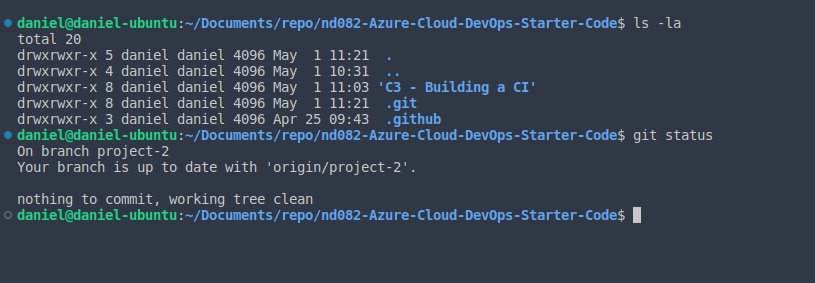

# Overview

For this project, we created a Continuous Integration and Continuous Delivery Chain from a provided "pre-set" code. We also reverse engineered it to work with our hand-created code, after cloning the provided templates.

Using GitHub Actions with a makefile, requirements, and python code, we performed an initial lint, test, and install cycle to verify deployment and functionality.

After finalizing the above step, we integrated the Github actions with Azure DevOps Pipelines, replacing the initial code with a pre-created sklearn code that will predict housing prices in Boston.

## Project Plan

* [Trello Board](https://trello.com/b/qT4hBPf3/project-management) for Project Planning
* [Project Plan](Documents/ProjectPlan.xlsx)

## Instructions

* Architectural Diagram located in Screenshots folder
* Screenshots/ArchitectureOverview.png (Image sourced from Udacity Course "DevOps Engineer for Microsoft Azure")

Please follow the following steps to setup the project

## Initial Setup:

1. Clone the repository from github: `https://github.com/thewhitelink/project2.git`

   
2. Change working directory to the scaffold folder:

   ```
   cd scaffold
   ```
3. Create Python virtual environment using the following command:

   ```
   python3 -m venv ~/.pyvenv-project_2
   ```
4. Source Virtual Environment using the following command:

   ```
   source ~/.pyvenv-project_2/bin/activate
   ```
5. Run

   ```
   make all
   ```

   
6. Modify to make fail, run:

   ```
   make test
   ```

   

## Python -

1. Navigate to flask-sklearn directory
2. Create python venv:

```
python3 -m venv ~/.pyvenv-cicd_project
```

3. Source the venv:
   ```
   source ~/.pyvenv-cicd_project/bin/activate
   ```
4. Install/Upgrade PIP:
   ```
   python -m pip install --upgrade pip
   ```
5. Install the required python modules using the predefined txt file:
   ```
   pip install -r requirements.txt
   ```

## Azure -

1. Run your web-app:

```
az webapp up --sku F1 -n
```

2. Make a prediction with the prediction file:

```
./make_predict_azure_app.sh
```

3. Display webapp logs:
   ```
   az webapp log tail
   ```

## Locust

1. Start locust on your local host
2. Go to the web page http://localhost:8089
3. Enter your test setup with required number of users

## Enhancements

Would be ideal to not require a screencast if you're also providing all of the instructions and screenshots

To keep things more consistent with a "production" environment, you could require branches be merged into a "master" branch for submission

## Demo

<TODO: Add link Screencast on YouTube>
